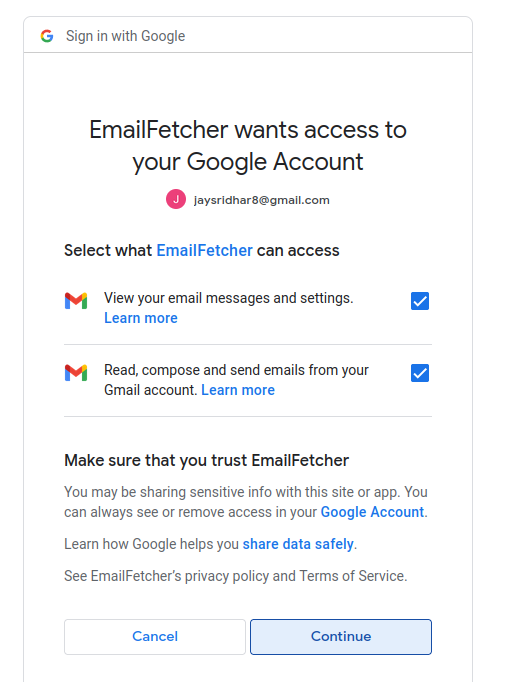
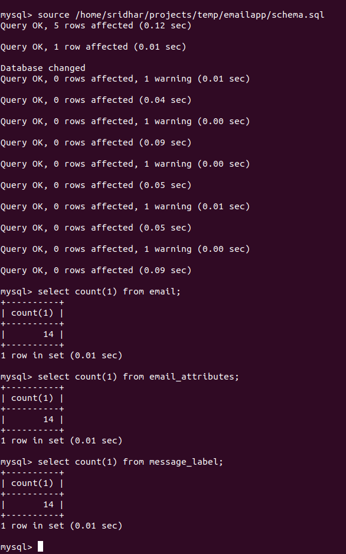
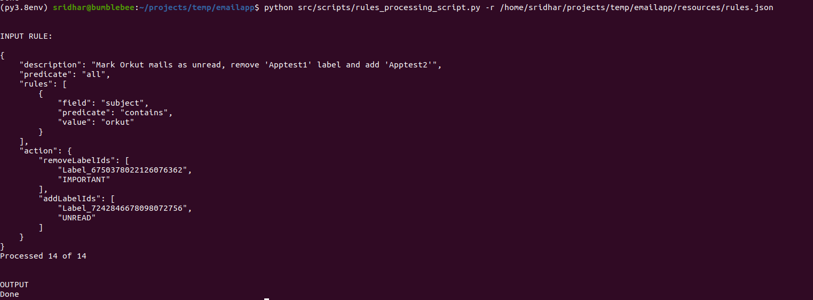

Prerequisites
-------------
  * Python 3.8+ 
  * MySQL server (7+) [download link](https://dev.mysql.com/downloads/)
  * Google Mail API setup

Google API setup
---------

1. Enable [Google mail APIs](https://console.cloud.google.com/flows/enableapi?apiid=gmail.googleapis.com)
2. Setup [OAuth credentials](https://console.cloud.google.com/apis/credentials?pli=1&project=restapi-274106)
3. Add [gmail.modify](https://www.googleapis.com/auth/gmail.modify) scope
3. Download the secrets (.json) and move it under src/config/ as credentials.json
4. Note: Upon running the project for the first time Google will ask for consent to allow the app to access your account via the APIs

Application setup steps
------------

After completing the prerequisites and the required Google API / OAuth setup follow the below steps to start using the application:

1. Download & extract or checkout the project from [GitHub](http://google.co.in)
2. Navigate to the project root (emailapp) folder and install the required python libraries (preferrably from a virtual environment) 
~~~
    cd emailapp
    pip install -r requirements.txt
~~~
3. Create the user "appuser" with remote DB access. (Need to modify the credentials stored in config/settings.py if you are creating a user with other credentials)
~~~~
CREATE USER 'appuser'@'localhost' IDENTIFIED BY '$ecr3tpas5w0rD';
CREATE DATABASE google_mail;
GRANT ALL ON google_mail.* TO 'appuser'@'localhost';
FLUSH PRIVILEGES;
~~~~
4. Source the database schema file, present in the project root (emailapp/) 
~~~~~
source schema.sql
~~~~~


5. Set the Python path to 'src' directory
~~~~~
cd src
export PYTHONPATH=$(pwd)
~~~~~

Running the application
----------

### Email syncing script ###

Email syncing script (when run without arguments) will download all the emails from your Gmail account to the MySQL database.

~~~~~
cd src/scripts
python email_download_script.py 
~~~~~
Notes:

1. When running the script for the first time, Google asks you to consent to the scopes required via a link.
After you give consent to the scopes from your Google account, a token.json file will be generated under src/config/.


2. Copy the URL into a browser and give consent.
 "Consent to read and modify scopes")

3. Running the above script would fetch all the emails from your Gmail account. You could make use of the available arguments to pull a subset of emails to the database.
~~~
usage: email_download_script.py [-h] [-f fetch_mode] [-m max_limit] [-s page_size] [-q querystring] [-l labels [labels ...]]

This script downloads given emails from your Gmail account. Running this script without arguments would fetch all the emails and save it to the MySQL database.

optional arguments:
  -h, --help            show this help message and exit
  -f fetch_mode         Specify the fetch mode. "full" is meant to be used for the first time synchronization or when fetching newer emails;
                        To update / refresh already stored emails, use "minimal"
  -m max_limit          Specify a maximum limit for the number of emails that should be fetched & saved.
  -s page_size          Specify the page size (when paging over a large result)
  -q querystring        Google email search query filter to be applied while fetching emails.
                         Refer https://support.google.com/mail/answer/7190?hl=en.
  -l labels [labels ...]
                        Specify one (or more) labels that should be filtered
~~~

### Rules processing script ###

Please refer to the existing rules.json (resources/rules.json)  for reference to add / modify new rules.
~~~~~
cd src/scripts
python rules_processing_script.py -r <path/to/rules.json> 
~~~~~

Demo screens
----
1. Scenario: From my Gmail account, I am looking to fetch messages from "Orkut" that are older than 2015 into the database.


2. Running the download script with filter condition to only fetch the needed emails for demo into the DB


3. Running the count queries to verify. 


4. A snapshot of the logs corresponding to the download action. Log file is available under the /logs folder which is placed under the project root, (/emailapp). Sample log


5. Configuring rules.json to remove "Apptest1" label, make the messages unread and add "Apptest2" label to the above Orkut messages, but this time using the rules processing script.


6. A snapshot of the rules processing script and the logs


7. Snapshot from my Gmail account after running the rules processor script


Note to Windows users
------------
Note for Windows users: Except the directory path and the python path setting, the other steps remain the same. Use  ```set pythonpath=<path\to\src>```.

Useful Limits
-------
| Category                                                                    | Limit |
|-----------------------------------------------------------------------------|:-----:|
| Maximum email content size (including encoding)                             | 25 MB |
| Google account's username - max characters allowed                          |  30   |
| Maximum recipients per email                                                |  500  |
| Maximum characters allowed in label names                                   |  225  |
| Maximum labels allowed per user account                                     |  500  |
| Maximum retention period for a trashed message (days)                       |  30   |
| Maximum page size when listing messages (via Gmail API)                     |  500  |
| Maximum GET requests that could be added to a batch request (via Gmail API) |  100  |
| Maximum message ids per bulk modify (via Gmail API)                         | 1000  |


Improvement areas
--------
1. Unit tests to be added.
2. Parallelism when fetching emails and processing rules.
3. Storing and indexing on to / cc values (separating alias and email ids)
4. Processing the message content (storage and searching). 
5. Support for nested rules (query builder).

Resources
-------
* Using search options in Gmail - [here](https://support.google.com/mail/answer/7190?hl=en)
* How to [batch process Google APIs](https://developers.google.com/gmail/api/guides/batch#format-of-a-batch-request)
* Quickstart Google API code for Python - [here](https://github.com/googleworkspace/python-samples/blob/main/gmail/quickstart/quickstart.py)
* [Gmail API documentation](https://developers.google.com/gmail/api/reference/rest)
